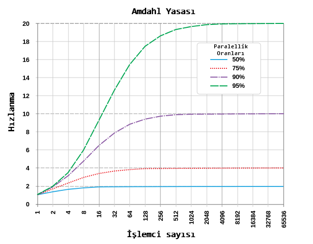
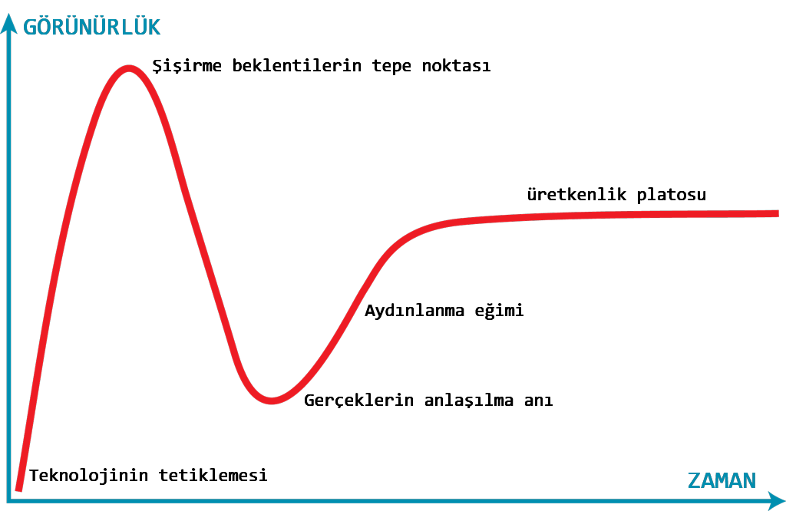

# 💻📖 hacker-laws-tr

Programcıların faydalı bulacağı yasalar, teoriler, prensipler ve desenler.

🇬🇧 [English / İngilizce İçin](https://github.com/dwmkerr/hacker-laws) - Teşekkürler [Dave Kerr](https://github.com/dwmkerr)!

🇨🇳 [中文 / Çince İçin](https://github.com/nusr/hacker-laws-zh) - Teşekkürler [Steve Xu](https://github.com/nusr)!

<!-- vim-markdown-toc GFM -->

* [Giriş](#giriş)
* [Yasalar](#kanunlar)
    * [Amdahl Yasası](#amdahl-yasası)
    * [Brooks Yasası](#brooks-yasası)
    * [Conway Yasası](#conway-yasası)
    * [Hanlon'un Usturası](#hanlonun-usturası)
    * [Hofstadter Yasası](#hofstadter-yasası)
    * [Hype Döngüsü ve Amara Yasası](#hype-döngüsü-ve-amara-yasası)
    * [Hyrum Yasası (Arabirimlerin Örtülü Hukuku)](#hyrum-yasası-arabirimlerin-örtülü-hukuku)
    * [Moore Yasası](#moore-yasası)
    * [Parkinson Yasası](#parkinson-yasası)
    * [Putt's Law](#putts-law)
    * [The Law of Conservation of Complexity (Tesler's Law)](#the-law-of-conservation-of-complexity-teslers-law)
    * [The Law of Leaky Abstractions](#the-law-of-leaky-abstractions)
    * [The Law of Triviality](#the-law-of-triviality)
    * [The Unix Philosophy](#the-unix-philosophy)
    * [The Spotify Model](#the-spotify-model)
    * [Wadler's Law](#wadlers-law)
* [Principles](#principles)
    * [The Pareto Principle (The 80/20 Rule)](#the-pareto-principle-the-8020-rule)
    * [The Robustness Principle (Postel's Law)](#the-robustness-principle-postels-law)
    * [SOLID](#solid)
    * [The Single Responsibility Principle](#the-single-responsibility-principle)
    * [The Open/Closed Principle](#the-openclosed-principle)
    * [The Liskov Substitution Principle](#the-liskov-substitution-principle)
    * [The Interface Segregation Principle](#the-interface-segregation-principle)
    * [The Dependency Inversion Principle](#the-dependency-inversion-principle)
    * [The DRY Principle](#the-dry-principle)
* [Reading List](#reading-list)
* [TODO](#todo)

<!-- vim-markdown-toc -->

## Giriş

İnsanların geliştirme hakkında konuşurken tartıştıkları birçok yasa var. Bu depo, en yaygın olanlardan bazılarının referanslarını ve özetini barındırır. Katkıda bulunmak için PR açıp gönderebilirsiniz!

❗: Bu depo yasaların, prensiplerin ve modellerin bilgi vermek amaçlı açıklamalarını içerir ve hiçbirini savunma amacı gütmez. Bunların hangisinin uygulanıp uygulanmayacağı tamamen tartışma konusudur ve yapılan işe bağlıdır.

## Yasalar

Tek tek başlayalım!

### Amdahl Yasası

[Wikipedia'da Amdahl Yasası](https://en.wikipedia.org/wiki/Amdahl%27s_law)

> Amdahl Yasası kaynakları artırarak bir hesaplama işleminin _olası hızlanma miktarını_ hesaplayan bir formülü tanımlar. Genellikle paralel işleme hesaplarında kullanılır ve işlemci sayısının artırılmasının programın paralelleştirilebilme kapasitesine bağlı olarak etkisinin doğru şekilde saplanmasını sağlar.

En güzel şu örnekle anlatılabilir. Bir programın iki bölümden oluştuğunu düşünelim. Bölüm A sadece tek işlemci ile çalıştırılabilir. Bölüm B ise paralleştirilebilecek şekilde yazılmış. Bu durumda bu programı çok işlemci ile çalıştırdığımızda Bölüm B'de oluşacak kadar bir kazanım sağlayabiliriz. Bölüm A'da her hangi bir katkı olamaycaktır.

Aşağıdaki diyagram bazı olası hız geliştirmelerine örnekler içeriyor:

*(Diyagramın kaynağı: By Daniels220 at English Wikipedia, Creative Commons Attribution-Share Alike 3.0 Unported, https://en.wikipedia.org/wiki/File:AmdahlsLaw.svg)*

Diyagramdaki örneklerden görüldüğü üzere, eğer bir programın sadece %50'si paraleleştirilebiliyorsa 10 işlemciden sonra işlemci eklemek hızda gözle görünür bir artış sağlamıyor ama %95 paralelleştirilebilen bir programda 1000 işlemciden sonra bile işlemci eklemenin hızı artırdığı gözlenebilir.

[Moore Yasasında](#moore-yasasi) söylenen artışın azalma eğiliminde olması ve aynı zamanda işlemci hızının artışında da ivme kaybı olması, paralelleştirilebilme özelliğini performans artışında anahtar duruma getirdi. Grafik programlama bu konuda en belirgin örnek. Shader tabanlı modern işleme ile pixel ve fragmanların paralel olarak render edilebilmesi sayesinde modern grafik kartlarında binlerce işlemci çekirdeği olabiliyor.

Ek kaynaklar:

- [Brooks Yasası](#brooks-yasasi)
- [Moore Yasası](#moores-yasasi)

### Brooks Yasası

[Wikipedia'da Brooks Yasası](https://en.m.wikipedia.org/wiki/Brooks%27s_law)

> Gecikmesi kesinleşmiş projeye yeni insan kaynağı eklemek projeyi daha da geciktirir.

Bu yasa, gecikmiş bir projeyi hızlandırmak için ek insan kaynağı koymanın projeyi daha geciktireceğini iddia ediyor. Brook'a göre bunun gereksiz bir sadeleştirme olduğu kesin. Yeni katılanların adapte edilmesi ve iletişim karmaşası hemen etkisini göstererek hızın yavaşlamasına sebep olur. Ayrıca, yapılacak işlerin birçoğu genellikle daha küçük parçalara bölünemez ve birden fazla kaynak bu işlerin yapılması için kullanılmaz. Bu durum beklenen artışın sağlanmaması ile sonuçlanır.

Meşhur "Dokuz kadın ile 1 ayda doğum sağlanamaz" deyimi bu yasanın en pratik anlatımıdır. Bazı işlerin bölünemediği veya paralelleştirilemediği gerçeğini unutmamak lazım.

'[The Mythical Man Month](#reading-list)' adlı kitabın ana konularından biri budur.

Ek kaynaklar:

- [Death March](#todo)
- [Reading List: The Mythical Man Month](#reading-list)

### Conway Yasası

[Wikipedia'da Conway Kanunu](https://en.wikipedia.org/wiki/Conway%27s_law)

Conway yasasi der ki; üretilen sistemler kendilerini üreten organizasyonun teknik sınırlarını yansıtır. Bu yasa daha çok organizasonel değişiklikler sırasında dikkate alınır. Eğer bir organizasyon birbirinden bağımsız küçük birimlerden oluşuyorsa üretilen yazılımlar da buna uygun olacaktır.  Eğer bu organizasyon servis odaklı dikey yapılandırılmışsa, yazılımlar bunu yansıtacaktır.

Ek kaynaklar:

- [Spotify Modeli](#spotify-modeli)

### Hanlon'un Usturası

[Wikipedia'da Hanlon'un Usturası](https://en.wikipedia.org/wiki/Hanlon%27s_razor)

> Aptallıkla layıkıyla açıklanabilecek bir şeyi, asla kötü niyete bağlamayın.
>
> Robert J. Hanlon

Bu prensip, olumsuz sonuçlara yol açan eylemlerin, çoğunlukla kötü niyetin sonucu olmadığını savunmaktadır. Aksine, olumsuz sonuç daha büyük olasılıkla bu eylemlerin ve/veya etkinin tam olarak anlaşılamamasına bağlıdır..

### Hofstadter Yasası

[Wikipedia'da Hofstadter Yasası](https://en.wikipedia.org/wiki/Hofstadter%27s_law)

> Bir iş her zaman umduğundan daha uzun sürer, Hofstadter yasasını gözönünde bulundursan bile. 
>
> Douglas Hofstadter

Bu yasayı bir işin ne kadar süreceğini tahminlenirken hatırlatıldığı için duymuş olabilirsiniz. Herkesin kabul bir gerçek var ki, yazılım geliştirmede en kötü olduğumuz alan işin ne kadar sürede biteceğini tahmin etmektir.

'[Gödel, Escher, Bach: An Eternal Golden Braid](#reading-list)' adlı kitaptan alıntı.

Ek kaynaklar:

- [Reading List: Gödel, Escher, Bach: An Eternal Golden Braid](#reading-list)

### Hype Döngüsü ve Amara Yasası

[Wikipedia'da Hype Döngüsü](https://en.wikipedia.org/wiki/Hype_cycle)

> Bir teknolojinin kısa vadede oluşacak etkisini abartıp, uzun vadede oluşacak etkisini hafife alıyoruz.
>
> (Roy Amara)

Hype Döngüsü bir teknolojinin zamanla yarattığı heyecan ve gelişiminin görsel olarak sunumudur ve Gartner tarafından ilk olarak oluşturulmuştur. En güzel anlatım aşağıdaki bir görsel ile yapılabilir:

*(Resmin Kaynağı: Jeremykemp tarafından İngilizce Wikipeda'da, CC BY-SA 3.0, https://commons.wikimedia.org/w/index.php?curid=10547051)*

Kısaca anlatmak gerekirse, bu döngü her yeni teknolojinin ilk zamanlarında teknolojinin kendisi ve olası etkisi üzerinde bir heyecan dalgası oluştuğunu iddia ediyor. Ekipler yeni teknolojiler hemen kullanmaya çalışıyorlar ve genelde kendilerini sonuçtan memnun olmamış bir halde buluyorlar. Bu ya teknolojinin henüz olgunlaşmamış olmasından, ya da uygulamanın tam anlamıyla gerçekleşmemiş olmasından olabilir. Belirli bir süre geçtikten sonra, teknolojinin yeterliliği ve pratik kullanım alanları artar ve ekipler daha üretken olmaya başlar. Roy Amara'nın sözü bu durumu en özlü şekilde toparlıyor diyebiliriz - "Bir teknolojinin kısa vadede oluşacak etkisini abartıp, uzun vadede oluşacak etkisini hafife alıyoruz".

### Hyrum Yasası (Arabirimlerin Örtülü Hukuku)

[Hyrum Yasası Web Sitesi](http://www.hyrumslaw.com/)

> Belli sayıda kullanıcıya ulaştığında,
> servis sözleşmesinde ne demiş olduğunuzdan bağımsız olarak
> ürününüzün ya da sisteminizin bütün gözlemlenebilir davranışları
> artık üçüncü kişilere göre şekillenecektir.
>
> (Hyrum Wright)

Hyrum Yasası göre, eğer bir API'nin _oldukça büyük sayılabilecek sayıda kullnıcısı_ olduğunda, artık bütün sonuçlar ve davranışlar (API sözleşmesinde belirtilmemiş olsalar bile) kullanıcılara göre şekillenecektir. Buna bir örnek olarak bir API'nin tepki süresi olabilir. Daha kapsamlı bir örnek olarak kullanıcıların bir regex ile dönen cevap metninin içinden hatanın tipini ayıkladıkları bir senaryoyu düşünelim. API sözleşmesinde bu cevap metinleri ile ilgili birşey belirtilmemiş olmasına ve kullanıcıların hata kodunu kullanmalarını belirtilmesine rağmen, cevap metnini değiştirmeniz _bazı_ kullanıcıların metni kullanmalarından dolayı hata ile karşılaşmalarına sebep olacaktır.

Ek kaynaklar:

- [The Law of Leaky Abstractions](#the-law-of-leaky-abstractions)
- [XKCD 1172](https://xkcd.com/1172/)

### Moore Yasası

[Wikipedia'da Moore Yasası](https://en.wikipedia.org/wiki/Moore%27s_law)

> Entegre devre içerisindeki transistörlerin sayısı yaklaşık olarak iki yılda bir ikiye katlanır.

Çoğu zaman yarı-iletken ve çip teknolojisinin gelişim hızını tahmin etmek için kullanılan Moore yasasının, 1970'lerden 2000'lerin sonlarına doğru oldukça doğru olduğu biliyoruz. Son yıllarda, [komponentlerin küçülmesinde fiziksel sınırlara ulaşıldığı için](https://en.wikipedia.org/wiki/Quantum_tunnelling) bu tahminlemenin tutmadığını da söyleyebiliriz. Ama paralleştirmede uzmanlaşılması ve yarı-iletken teknolojilerindeki devrim potensiyelindeki değişiklikler Moore Yasası'nın yakın zamanda tekrar doğrulanacağını tahminler yapabileceğini düşünebiliriz.

### Parkinson Yasası

[Wikipedia'da Parkinson Yasası](https://en.wikipedia.org/wiki/Parkinson%27s_law)

> Bir iş, daima, bitirilmesi için kendisine ayrılan sürenin hepsini kapsayacak şekilde uzar.

Orijinal bağlamında, bu kanun bürokrasi alanındaki çalışmalara dayanıyordu. Kötümser bir bakış açısıyla yazılım geliştirme girişimleri için de söylenebilir. Şöyle ki ekipler genelde proje bitiş tarihi yaklaşana kadar düşük verimde çalışırlar, itiş tarihi yaklaştıkça bitirmek için yoğun bir çaba içine girerler ve sonuç olarak aslında bitiş tarihini tutturmuş olurlar.

Bu yasa ile [Hofstadter Yasası](#hofstadter-yasası) birleştirilirse, daha kötümser bir yasaya ulaşılır. Bir iş bitirilmesi için harcanması gereken zamanı kapsar ve *her zaman gecikir*.

Ek kaynaklar:

- [Hofstadter Yasası](#hofstadter-yasası)

### Putt's Law

[Putt's Law on Wikipedia](https://en.wikipedia.org/wiki/Putt%27s_Law_and_the_Successful_Technocrat)

> Technology is dominated by two types of people, those who understand what they do not manage and those who manage what they do not understand.

Putt's Law is often followed by Putt's Corollary:

> Every technical hierarchy, in time, develops a competence inversion.

These statements suggest that due to various selection criteria and trends in how groups organise, there will be a number of skilled people at working levels of a technical organisations, and a number of people in managerial roles who are not aware of the complexities and challenges of the work they are managing. This can be due to phenomena such as [The Peter Principle](#TODO) or [Dilbert's Law](#TODO).

However, it should be stressed that Laws such as this are vast generalisations and may apply to _some_ types of organisations, and not apply to others.

See also:

- [The Peter Principle](#TODO)
- [Dilbert's Law](#TODO).

### The Law of Conservation of Complexity (Tesler's Law)

[The Law of Conservation of Complexity on Wikipedia](https://en.wikipedia.org/wiki/Law_of_conservation_of_complexity)

This law states that there is a certain amount of complexity in a system which cannot be reduced.

Some complexity in a system is 'inadvertent'. It is a consequence of poor structure, mistakes, or just bad modeling of a problem to solve. Inadvertent complexity can be reduced (or eliminated). However, some complexity is 'intrinsic' as a consequence of the complexity inherent in the problem being solved. This complexity can be moved, but not eliminated.

One interesting element to this law is the suggestion that even by simplifying the entire system, the intrinsic complexity is not reduced, it is _moved to the user_, who must behave in a more complex way.

### The Law of Leaky Abstractions

[The Law of Leaky Abstractions on Joel on Software](https://www.joelonsoftware.com/2002/11/11/the-law-of-leaky-abstractions/)

> All non-trivial abstractions, to some degree, are leaky.
>
> (Joel Spolsky)

This law states that abstractions, which are generally used in computing to simplify working with complicated systems, will in certain situations 'leak' elements of the underlying system, this making the abstraction behave in an unexpected way.

An example might be loading a file and reading its contents. The file system APIs are an _abstraction_ of the lower level kernel systems, which are themselves an abstraction over the physical processes relating to changing data on a magnetic platter (or flash memory for an SSD). In most cases, the abstraction of treating a file like a stream of binary data will work. However, for a magnetic drive, reading data sequentially will be *significantly* faster than random access (due to increased overhead of page faults), but for an SSD drive, this overhead will not be present. Underlying details will need to be understood to deal with this case (for example, database index files are structured to reduce the overhead of random access), the abstraction 'leaks' implementation details the developer may need to be aware of.

The example above can become more complex when _more_ abstractions are introduced. The Linux operating system allows files to be accessed over a network but represented locally as 'normal' files. This abstraction will 'leak' if there are network failures. If a developer treats these files as 'normal' files, without considering the fact that they may be subject to network latency and failures, the solutions will be buggy.

The article describing the law suggests that an over-reliance on abstractions, combined with a poor understanding of the underlying processes, actually makes dealing with the problem at hand _more_ complex in some cases.

See also:

- [Hyrum's Law](#hyrums-law-the-law-of-implicit-interfaces)

Real-world examples:

- [Photoshop Slow Startup](https://forums.adobe.com/thread/376152) - an issue I encountered in the past. Photoshop would be slow to startup, sometimes taking minutes. It seems the issue was that on startup it reads some information about the current default printer. However, if that printer is actually a network printer, this could take an extremely long time. The _abstraction_ of a network printer being presented to the system similar to a local printer caused an issue for users in poor connectivity situations.

### The Law of Triviality

[The Law of Triviality on Wikipedia](https://en.wikipedia.org/wiki/Law_of_triviality)

This law suggests that groups will give far more time and attention to trivial or cosmetic issues rather than serious and substantial ones.

The common fictional example used is that of a committee approving plans for nuclear power plant, who spend the majority of their time discussing the structure of the bike shed, rather than the far more important design for the power plant itself. It can be difficult to give valuable input on discussions about very large, complex topics without a high degree of subject matter expertise or preparation. However, people want to be seen to be contributing valuable input. Hence a tendency to focus too much time on small details, which can be reasoned about easily, but are not necessarily of particular importance.

The fictional example above led to the usage of the term 'Bike Shedding' as an expression for wasting time on trivial details.

### The Unix Philosophy

[The Unix Philosophy on Wikipedia](https://en.wikipedia.org/wiki/Unix_philosophy)

The Unix Philosophy is that software components should be small, and focused on doing one specific thing well. This can make it easier to build systems by composing together small, simple, well-defined units, rather than using large, complex, multi-purpose programs.

Modern practices like 'Microservice Architecture' can be thought of as an application of this law, where services are small, focused and do one specific thing, allowing complex behaviour to be composed of simple building blocks.

### The Spotify Model

[The Spotify Model on Spotify Labs](https://labs.spotify.com/2014/03/27/spotify-engineering-culture-part-1/)

The Spotify Model is an approach to team and organisation structure which has been popularised by 'Spotify'. In this model, teams are organised around features, rather than technologies.

The Spotify Model also popularises the concepts of Tribes, Guilds, Chapters, which are other components of their organisation structure.

### Wadler's Law

[Wadler's Law on wiki.haskell.org](https://wiki.haskell.org/Wadler's_Law)

> In any language design, the total time spent discussing a feature in this list is proportional to two raised to the power of its position.
> 
> 0. Semantics
> 1. Syntax
> 2. Lexical syntax
> 3. Lexical syntax of comments
> 
> (In short, for every hour spent on semantics, 8 hours will be spent on the syntax of comments).

Similar to [The Law of Triviality](#the-law-of-triviality), Wadler's Law states what when designing a language, the amount of time spent on language structures is disproportionately high in comparison to the importance of those features.

See also:

- [The Law of Triviality](#the-law-of-triviality)

## Principles

Principles are generally more likely to be guidelines relating to design.

### The Pareto Principle (The 80/20 Rule)

[The Pareto Principle on Wikipedia](https://en.wikipedia.org/wiki/Pareto_principle)

> Most things in life are not distributed evenly.

The Pareto Principle suggests that in some cases, the majority of results come from a minority of inputs:

- 80% of a certain piece of software can be written in 20% of the total allocated time (conversely, the hardest 20% of the code takes 80% of the time)
- 20% of the effort produces 80% of the result
- 20% of the work creates 80% of the revenue
- 20% of the bugs cause 80% of the crashes
- 20% of the features cause 80% of the usage

In the 1940s American-Romanian engineer Dr. Joseph Juran, who is widely credited with being the father of quality control, [began to apply the Pareto principle to quality issues](https://en.wikipedia.org/wiki/Joseph_M._Juran).

This principle is also known as: The 80/20 Rule, The Law of the Vital Few and The Principle of Factor Sparsity.

Real-world examples:

- In 2002 Microsoft reported that by fixing the top 20% of the most-reported bugs, 80% of the related errors and crashes in windows and office would become eliminated ([Reference](https://www.crn.com/news/security/18821726/microsofts-ceo-80-20-rule-applies-to-bugs-not-just-features.htm)).

### The Robustness Principle (Postel's Law)

[The Robustness Principle on Wikipedia](https://en.wikipedia.org/wiki/Robustness_principle)

> Be conservative in what you do, be liberal in what you accept from others.

Often applied in server application development, this principle states that what you send to others should be as minimal and conformant as possible, but you should be aim to allow non-conformant input if it can be processed.

The goal of this principle is to build systems which are robust, as they can handle poorly formed input if the intent can still be understood. However, there are potentially security implications of accepting malformed input, particularly if the processing of such input is not well tested.

### SOLID

This is an acronym, which refers to:

* S: [The Single Responsibility Principle](#the-single-responsibility-principle)
* O: [The Open/Closed Principle](#the-openclosed-principle)
* L: [The Liskov Substitution Principle](#the-liskov-substitution-principle)
* I: [The Interface Segregation Principle](#the-interface-segregation-principle)
* D: [The Dependency Inversion Principle](#the-dependency-inversion-principle)

These are key principles in [Object-Oriented Programming](#todo). Design principles such as these should be able to aid developers build more maintainable systems.

### The Single Responsibility Principle

[The Single Responsibility Principle on Wikipedia](https://en.wikipedia.org/wiki/Single_responsibility_principle)

> Every module or class should have a single responsibility only.

The first of the '[SOLID](#solid)' principles. This principle suggests that modules or classes should do one thing and one thing only. In more practical terms, this means that a single, small change to a feature of a program should require a change in one component only. For example, changing how a password is validated for complexity should require a change in only one part of the program.

Theoretically, this should make the code more robust, and easier to change. Knowing that a component which is being changed has a single responsibility only means that _testing_ that change should be easier. Using the earlier example, changing the password complexity component should only be able to affect the features which relate to password complexity. It can be much more difficult to reason about the impact of a change to a component which has many responsibilities.

See also:

- [Object-Oriented Programming](#todo)
- [SOLID](#solid)

### The Open/Closed Principle

[The Open/Closed Principle on Wikipedia](https://en.wikipedia.org/wiki/Open%E2%80%93closed_principle)

> Entities should be open for extension and closed for modification.

The second of the '[SOLID](#solid)' principles. This principle states that entities (which could be classes, modules, functions and so on) should be able to have their behaviour _extended_, but that their _existing_ behaviour should not be able to be modified.

As a hypothetical example, imagine a module which is able to turn a Markdown document into HTML. If the module could be extended to handle a newly proposed markdown feature, without modifying the module internals, then it would be open for extension. If the module could _not_ be modified by a consumer so that how existing Markdown features are handled, then it would be _closed_ for modification.

This principle has particular relevance for object-oriented programming, where we may design objects to be easily extended, but would avoid designing objects which can have their existing behaviour changed in unexpected ways.

See also:

- [Object-Oriented Programming](#todo)
- [SOLID](#solid)

### The Liskov Substitution Principle

[The Liskov Substitution Principle on Wikipedia](https://en.wikipedia.org/wiki/Liskov_substitution_principle)

> It should be possible to replace a type with a subtype, without breaking the system.

The third of the '[SOLID](#solid)' principles. This principle states that if a component relies on a type, then it should be able to use subtypes of that type, without the system failing or having to know the details of what that subtype is.

As an example, imagine we have a method which reads an XML document from a structure which represents a file. If the method uses a base type 'file', then anything which derives from 'file' should be able to be used in the function. If 'file' supports seeking in reverse, and the XML parser uses that function, but the derived type 'network file' fails when reverse seeking is attempted, then the 'network file' would be violating the principle.

This principle has particular relevance for object-oriented programming, where type hierarchies must be modeled carefully to avoid confusing users of a system.

See also:

- [Object-Oriented Programming](#todo)
- [SOLID](#solid)

### The Interface Segregation Principle

[The Interface Segregation Principle on Wikipedia](https://en.wikipedia.org/wiki/Interface_segregation_principle)

> No client should be forced to depend on methods it does not use.

The fourth of the '[SOLID](#solid)' principles. This principle states that consumers of a component should not depend on functions of that component which it doesn't actually use.

As an example, imagine we have a method which reads an XML document from a structure which represents a file. It only needs to read bytes, move forwards or move backwards in the file. If this method needs to be updated because an unrelated feature of the file structure changes (such as an update to the permissions model used to represent file security), then the principle has been invalidated. It would be better for the file to implement a 'seekable-stream' interface, and for the XML reader to use that.

This principle has particular relevance for object-oriented programming, where interfaces, hierarchies and abstract types are used to [minimise the coupling](#todo) between different components. [Duck typing](#todo) is a methodology which enforces this principle by eliminating explicit interfaces.

See also:

- [Object-Oriented Programming](#todo)
- [SOLID](#solid)
- [Duck Typing](#todo)
- [Decoupling](#todo)

### The Dependency Inversion Principle

[The Dependency Inversion Principle](https://en.wikipedia.org/wiki/Dependency_inversion_principle)

> High-level modules should not be dependent on low-level implementations.

The fifth of the '[SOLID](#solid)' principles. This principle states that higher level orchestrating components should not have to know the details of their dependencies.

As an example, imagine we have a program which read metadata from a website. We would assume that the main component would have to know about a component to download the webpage content, then a component which can read the metadata. If we were to take dependency inversion into account, the main component would depend only on an abstract component which can fetch byte data, and then an abstract component which would be able to read metadata from a byte stream. The main component would not know about TCP/IP, HTTP, HTML, etc.

This principle is complex, as it can seem to 'invert' the expected dependencies of a system (hence the name). In practice, it also means that a separate orchestrating component must ensure the correct implementations of abstract types are used (e.g. in the previous example, _something_ must still provide the metadata reader component a HTTP file downloader and HTML meta tag reader). This then touches on patterns such as [Inversion of Control](#todo) and [Dependency Injection](#todo).

See also:

- [Object-Oriented Programming](#todo)
- [SOLID](#solid)
- [Inversion of Control](#todo)
- [Dependency Injection](#todo)

### The DRY Principle

[The DRY Principle on Wikipedia](https://en.wikipedia.org/wiki/Don%27t_repeat_yourself)

> Every piece of knowledge must have a single, unambiguous, authoritative representation within a system.

DRY is an acronym for _Don't Repeat Yourself_. This principle aims to help developers reducing the repetition of code and keep the information in a single place and was cited in 1999 by Andrew Hunt and Dave Thomas in the book [The Pragmatic Developer](https://en.wikipedia.org/wiki/The_Pragmatic_Programmer)

> The opposite of DRY would be _WET_ (Write Everything Twice or We Enjoy Typing).

In practice, if you have the same piece of information in two (or more) different places, you can use DRY to merge them into a single one and reuse it wherever you want/need.

See also:

- [The Pragmatic Developer](https://en.wikipedia.org/wiki/The_Pragmatic_Programmer)

## Reading List

If you have found these concepts interesting, you may enjoy the following books.

- [The Mythical Man Month - Frederick P. Brooks Jr.](https://www.goodreads.com/book/show/13629.The_Mythical_Man_Month) - A classic volume on software engineering. [Brooks's Law](#brookss-law) is a central theme of the book.
- [Gödel, Escher, Bach: An Eternal Golden Braid - Douglas R. Hofstadter.](https://www.goodreads.com/book/show/24113.G_del_Escher_Bach) - This book is difficult to classify. [Hofstadter's Law](#hofstadters-law) is from the book.

## TODO

Hi! If you land here, you've clicked on a link to a topic I've not written up yet, sorry about this - this is work in progress!

Feel free to [Raise an Issue](https://github.com/dwmkerr/hacker-laws/issues) requesting more details, or [Open a Pull Request](https://github.com/dwmkerr/hacker-laws/pulls) to submit your proposed definition of the topic. 
